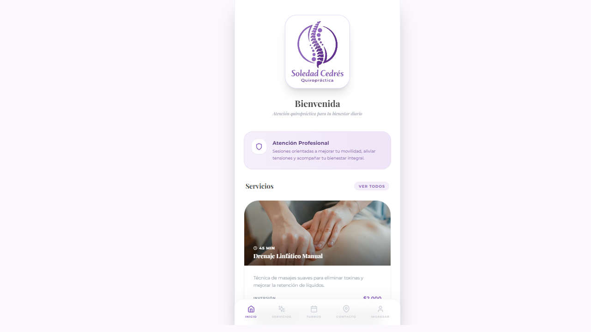
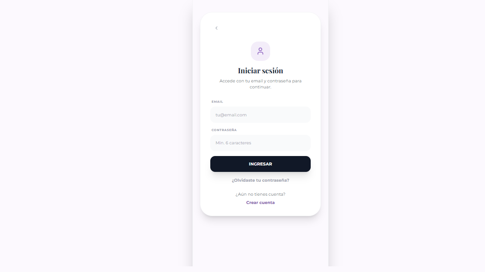
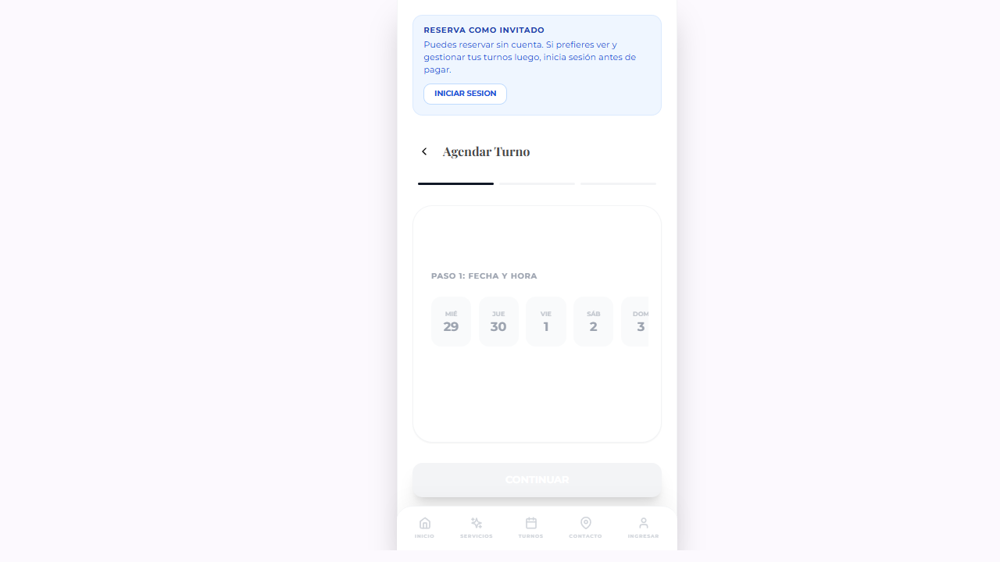
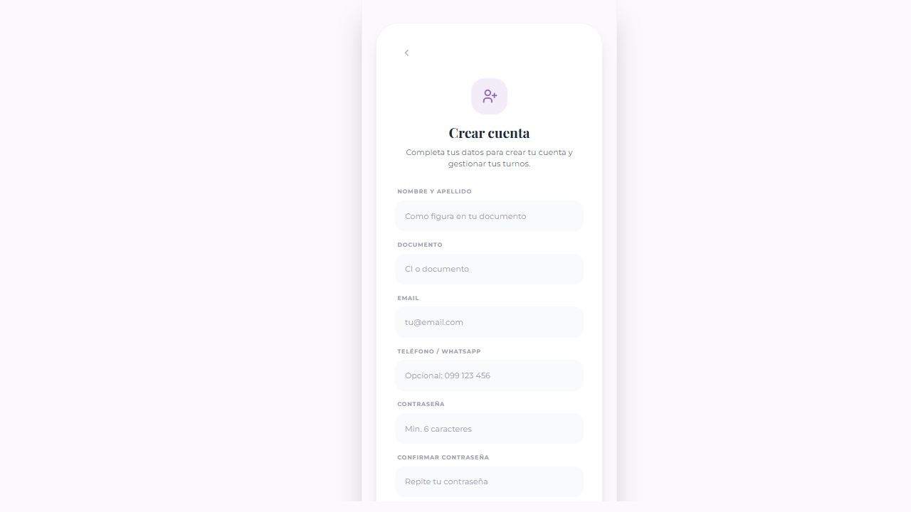

# Manual de uso para la dueña del negocio

Este instructivo está pensado para ayudarte a usar la aplicación en el día a día sin necesidad de conocimientos técnicos.

La app te permite:

- ver los turnos que se van confirmando
- bloquear horarios para que no se puedan reservar
- crear, editar o quitar servicios
- crear promociones y decidir si se muestran destacadas
- dar acceso de administración a otra persona de confianza
- llevar la ficha de cada paciente y registrar su evolución

## 1. Antes de empezar

Para entrar al panel de gestión necesitas una cuenta con permiso de administradora.

Pasos:

1. Abre la app.
2. Entra en \`Cuenta\`.
3. Inicia sesión con tu email y contraseña.
4. Si tu cuenta tiene permiso de administradora, verás la opción \`Panel de gestión\`.

Si no ves esa opción, significa que tu usuario todavía no tiene permiso de administración.

Si es la primera vez que usas una cuenta recién creada y no te deja entrar, revisa tu correo y confirma la cuenta desde el mensaje recibido. Si no lo ves, revisa también la carpeta de correo no deseado.

## 2. Cómo entrar al panel de gestión

1. En la barra de navegación entra en \`Cuenta\`.
2. Inicia sesión.
3. Toca \`Panel de gestión\`.

Dentro del panel verás estas secciones:

- \`Turnos\`
- \`Bloqueos\`
- \`Servicios\`
- \`Promociones\`
- \`Usuarios\`
- \`Historia clínica\`

## 3. Qué pasa cuando una persona reserva un turno

El flujo de reserva funciona así:

1. La persona elige un servicio.
2. Selecciona día y hora.
3. Completa sus datos.
4. Realiza el pago.
5. Solo si el pago se aprueba, el turno queda confirmado dentro del sistema.

Importante:

- si el pago no se completa, el turno no se guarda como confirmado
- los horarios ocupados o bloqueados dejan de aparecer como disponibles
- la clienta puede ver sus propios turnos desde \`Mis turnos\`

Nota interna:

- el sistema muestra disponibilidad pública sin exponer datos personales de otras clientas
- si alguna vez cambian reglas o backend y notas horarios viejos sin bloquear, pide al equipo técnico ejecutar una sincronización inicial de horarios ocupados

### Reserva con cuenta vs. reserva como invitada

Las clientas pueden reservar de dos formas:

- **Con cuenta registrada**: si la persona ya tiene su cuenta creada e inicia sesión antes de reservar, sus datos (nombre, teléfono) se cargan automáticamente. El turno queda vinculado a su cuenta y ella podrá verlo desde \`Mis turnos\`.
- **Como invitada**: si la persona no tiene cuenta o no inicia sesión, puede reservar igual completando su nombre, teléfono y email en el paso 2. También puede completar su documento de forma opcional. El turno queda registrado normalmente, pero ella no podrá verlo desde la app (solo tú lo verás en el panel).

En el panel de turnos puedes distinguirlos por el badge que aparece en cada tarjeta:

- **"Cuenta"** (verde): la reserva fue hecha por una usuaria registrada.
- **"Invitado"** (amarillo): la reserva fue hecha sin cuenta.

## 4. Sección Turnos

En `Turnos` puedes revisar las reservas confirmadas de forma rápida y organizada.

### Visualización de turnos

Qué vas a ver en cada turno:

- servicio reservado
- fecha y hora
- nombre de la persona
- teléfono
- importe abonado
- si tuvo promoción aplicada
- badge **"Cuenta"** o **"Invitado"** según cómo se hizo la reserva

### Buscar un turno específico

En la barra **"Buscar por nombre, teléfono, email o servicio"** puedes escribir:

- nombre de la persona
- número de teléfono
- email de la clienta
- nombre del servicio

Mientras escribes, la lista se actualiza automáticamente mostrando solo los turnos coincidentes.

### Filtrar turnos

Debajo de la barra de búsqueda encontrarás filtros independientes que puedes combinar:

**1. Estado temporal:**

- `Todos`: muestra toda la lista
- `Solo hoy`: solo turnos de hoy
- `Próximos (incluye hoy)`: turnos desde hoy en adelante
- `Pasados`: turnos vencidos

**2. Modo de reserva:**

- `Todos`: todas las reservas
- `Solo Cuenta`: solo reservas de usuarios registrados
- `Solo Invitado`: solo reservas sin cuenta

**3. Estado de pago:**

- `Todos`: todas las reservas
- `Pagados`: turnos con pago completado
- `Sin pago`: turnos no pagados

**4. Rango de fechas:**

- Selecciona una fecha de inicio y una fecha de fin para filtrar dentro de ese período

### Limpiar filtros

El botón **"Limpiar filtros"** reinicia todos los filtros a sus valores por defecto:

- búsqueda: vacía
- estado temporal: próximos
- modo: todos
- pago: todos
- fechas: sin rango

### Contador de resultados

Bajo los filtros verás el número de turnos que coinciden: `X resultado(s)`.

Esto te ayuda a saber cuántos turnos hay con los filtros aplicados.

### Carga incremental de turnos

Para que la pantalla sea rápida incluso con cientos de turnos:

- los primeros 20 turnos se cargan automáticamente
- cuando termines de revisar estos, un botón **"Cargar 20 más"** aparece al final
- pulsa el botón para ver los siguientes 20 turnos

Para qué te sirve esta sección:

- confirmar que una reserva ya quedó registrada
- revisar quién reservó y qué servicio eligió
- controlar precios finales cuando hubo descuento
- cancelar un turno si hace falta

### Ver datos de contacto completos (modal)

En cada tarjeta de turno verás un ícono de información junto al nombre de la paciente.

1. Pulsa ese ícono.
2. Se abrirá una ventana con información ampliada de contacto.

En esa ventana podrás ver:

- nombre
- teléfono (con acceso directo a WhatsApp)
- correo electrónico
- documento (si fue proporcionado en la reserva)
- tipo de reserva (Cuenta o Invitado)

Puedes cerrarla con el botón \`Cerrar\` o tocando fuera de la ventana.

Sugerencia de uso diario:

1. Revisa esta pestaña al comenzar y al terminar tu jornada.
2. Confirma que los turnos del día siguiente estén correctos.
3. Si una persona te avisa que no asistirá, elimina el turno para liberar ese espacio.

## 5. Sección Bloqueos

Esta sección sirve para cerrar horarios manualmente. Es útil cuando no atenderás en determinado momento, aunque normalmente ese horario exista.

Ejemplos:

- una reunión
- un feriado
- una salida personal
- tiempo reservado para descanso

### Cómo bloquear un horario

1. Entra en \`Bloqueos\`.
2. Elige la fecha.
3. Elige la hora.
4. Pulsa \`Bloquear horario\`.

Resultado:

Ese horario dejará de mostrarse como disponible cuando alguien quiera reservar.

### Cómo desbloquear un horario

1. En la misma pestaña, busca el bloqueo en la lista \`Horarios bloqueados\`.
2. Pulsa \`Desbloquear\`.

Resultado:

Ese horario volverá a quedar disponible, siempre que no esté ya ocupado por un turno.

## 6. Sección Servicios

Aquí administras el catálogo que ven las personas al entrar a la app.

### Crear un servicio nuevo

1. Entra en \`Servicios\`.
2. Baja hasta el formulario \`Nuevo servicio\`.
3. Completa:
   - nombre del servicio
   - precio
   - duración en minutos
   - imagen opcional
   - descripción
4. Pulsa \`Crear servicio\`.

Consejos para que se vea bien:

- usa nombres claros y cortos
- escribe descripciones simples, enfocadas en el beneficio para la persona
- sube imágenes prolijas y luminosas
- revisa el precio antes de guardar

### Editar un servicio

1. Busca el servicio en la lista.
2. Pulsa \`Editar\`.
3. Cambia lo que necesites.
4. Pulsa \`Actualizar servicio\`.

### Eliminar un servicio

1. Busca el servicio en la lista.
2. Pulsa \`Eliminar\`.

Recomendación:

Antes de eliminar un servicio, asegúrate de que realmente no lo vas a ofrecer más. Si solo quieres cambiarlo, conviene editarlo.

## 7. Sección Promociones

Esta sección sirve para crear campañas especiales y descuentos.

Cada promoción puede tener:

- un título
- una frase corta o etiqueta
- un descuento en porcentaje o en dinero
- una fecha de inicio y una fecha de fin
- imagen
- estado publicado o pausado
- opción de destacarse en la pantalla principal
- aplicación a todos los servicios o solo a algunos

### Crear una promoción

1. Entra en \`Promociones\`.
2. Completa el formulario \`Nueva promoción\`.
3. Define si el descuento será:
   - en porcentaje, por ejemplo \`20%\`
   - en importe fijo, por ejemplo \`$ 500\`
4. Indica desde cuándo y hasta cuándo estará vigente.
5. Decide si estará:
   - \`Publicada\`, para que se use
   - \`Destacada en Home\`, para mostrarla como principal
6. Elige si aplica a todos los servicios o solo a algunos.
7. Pulsa \`Crear promoción\`.

### Editar una promoción

1. Busca la promoción en la lista.
2. Pulsa \`Editar\`.
3. Ajusta lo necesario.
4. Pulsa \`Actualizar promoción\`.

### Pausar una promoción sin borrarla

1. Entra a editar la promoción.
2. Desmarca la opción \`Publicada\`.
3. Guarda los cambios.

Esto te permite conservar la promoción cargada sin que se aplique en nuevas reservas.

### Eliminar una promoción

1. Busca la promoción en la lista.
2. Pulsa \`Eliminar\`.

### Cómo elegir cuál se destaca primero

El campo \`Prioridad\` sirve para ordenar promociones cuando hay varias activas.

- un número más alto le da más importancia
- si quieres que una promoción aparezca por encima de otra, dale una prioridad mayor

Ejemplo:

- Promoción A: prioridad 200
- Promoción B: prioridad 100

En ese caso, la A tendrá preferencia.

## 8. Sección Usuarios

Esta sección te permite dar acceso de administradora a otra persona o quitárselo.

Las clientas que se registran aparecen en esta lista con su nombre completo, número de documento y email.

Importante:

- la otra persona primero debe tener su propia cuenta creada en la app
- esa persona también debe confirmar su correo para poder ingresar
- luego aparecerá en la lista de usuarios

### Dar permiso de administradora

1. Pide a la persona que se registre en la app con su email.
2. Entra en \`Usuarios\`.
3. Busca su email en la lista.
4. Pulsa \`Hacer admin\`.

### Quitar permiso de administradora

1. Entra en \`Usuarios\`.
2. Busca a la persona en la lista.
3. Pulsa \`Quitar admin\`.

Ten en cuenta:

- no podrás quitarte el permiso a ti misma desde tu propia sesión
- conviene dar acceso solo a personas de absoluta confianza

## 9. Sección Historia clínica

Esta sección está pensada para el seguimiento profesional de cada paciente.

Permite guardar dos cosas:

- la ficha inicial de la persona
- la evolución de cada sesión

### 9.1. Ficha inicial

En la ficha puedes guardar, entre otros datos:

- nombre completo
- documento
- fecha de nacimiento
- teléfono y email
- ocupación
- contacto de emergencia
- motivo de consulta
- zonas de dolor
- intensidad del dolor
- factores que empeoran o alivian
- antecedentes de salud
- diagnóstico inicial
- fecha de inicio del tratamiento

### 9.2. Evolución por sesión

En cada sesión puedes anotar:

- fecha
- nivel de dolor
- observaciones
- técnicas aplicadas
- recomendaciones

### Forma sugerida de trabajo

1. Selecciona a la paciente.
2. Completa o actualiza su ficha inicial.
3. Guarda.
4. Después de cada consulta, registra una nueva evolución.

Beneficio:

Tendrás el historial ordenado de cada persona en un solo lugar.

## 10. Cómo revisar si una reserva quedó bien registrada

Cuando una persona te diga que pagó y reservó, verifica lo siguiente:

1. Entra en \`Turnos\`.
2. Busca el nombre, la fecha y la hora.
3. Revisa que el servicio y el importe sean correctos.

Si no aparece:

- es posible que el pago no se haya completado
- también puede haber abandonado el proceso antes del final

En ese caso, pídele que vuelva a intentar la reserva.

Si el pago quedó aprobado pero el horario no aparece bloqueado en la agenda pública, avisa al equipo técnico para que revise la sincronización de horarios ocupados.

## 11. Buenas prácticas recomendadas

- revisa los turnos todos los días
- bloquea con anticipación los horarios en los que no atenderás
- mantén los precios actualizados
- usa promociones con fecha de fin para evitar descuentos activos por error
- antes de dar permiso de administradora, confirma bien el email de la persona
- completa la historia clínica el mismo día de la consulta para no olvidar detalles

## 12. Edición de datos de cuenta

Las clientas pueden editar sus propios datos desde la sección \`Cuenta\` de la app sin necesidad de contactarte.

Pueden modificar:

- nombre y apellido
- número de documento
- teléfono / WhatsApp
- dirección de email (requiere ingresar la contraseña actual para confirmar)
- contraseña (requiere ingresar la contraseña actual)

Esto es útil si una clienta cambia de número o necesita actualizar su información antes de una reserva.

## 13. Preguntas frecuentes

### Una persona me dice que pagó, pero no veo el turno

Primero revisa la sección \`Turnos\`. Si no está, lo más probable es que el pago no haya quedado aprobado o que el proceso no se haya terminado.

### Una persona reservó como invitada y quiere ver sus turnos

Las reservas hechas sin cuenta no son visibles desde la app para la clienta. Si quiere tener acceso a su historial, debe crearse una cuenta en la app. Las reservas futuras hechas con esa cuenta quedarán vinculadas y accesibles desde \`Mis turnos\`.

### Quiero dejar una promoción preparada para la semana que viene

Puedes crearla ahora mismo y cargar su fecha de inicio. Así quedará pronta sin activarse antes de tiempo.

### Quiero esconder una promoción sin borrarla

Edita la promoción y quita la marca de \`Publicada\`.

### No quiero que reserven cierto horario mañana

Ve a \`Bloqueos\`, elige la fecha y la hora, y guarda el bloqueo.

### Quiero que otra secretaria me ayude con la app

Primero esa persona debe crearse una cuenta y confirmar su correo. Después, desde \`Usuarios\`, puedes darle permiso de administradora.

## 14. Resumen rápido de tareas comunes

### Para bloquear una hora

\`Panel de gestión > Bloqueos > Fecha + Hora > Bloquear horario\`

### Para agregar un servicio

\`Panel de gestión > Servicios > Nuevo servicio > Completar datos > Crear servicio\`

### Para lanzar una promoción

\`Panel de gestión > Promociones > Nueva promoción > Completar datos > Crear promoción\`

### Para dar acceso admin a otra persona

\`Panel de gestión > Usuarios > Buscar email > Hacer admin\`

### Para cargar la ficha de un paciente

\`Panel de gestión > Historia clínica > Seleccionar paciente > Completar ficha > Guardar\`

---

Si necesitás más ayuda, consultá con quien desarrolló la aplicación.
